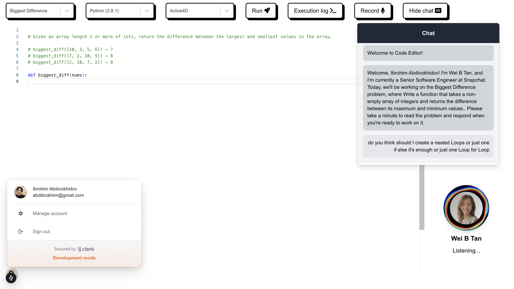
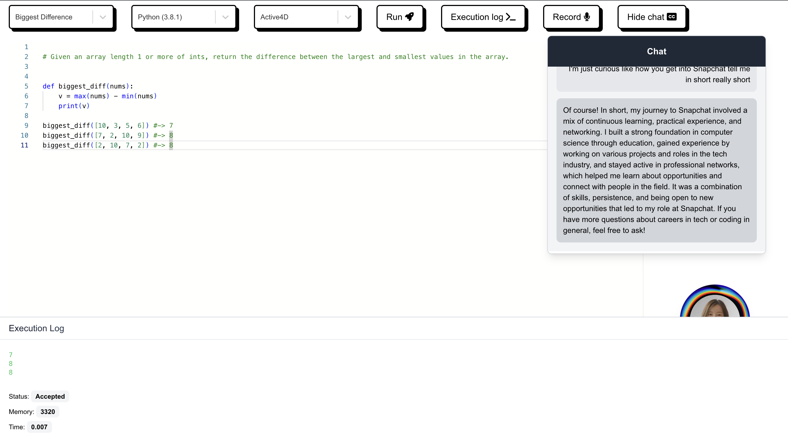
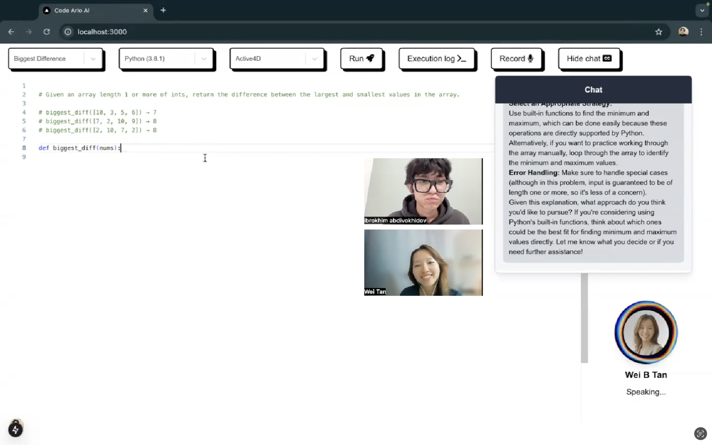

# PrepAlly

We’re building PrepAlly to fill a critical gap in coding interview preparation. Current tools offer practice but fall short of providing the interactive, AI-driven insights candidates need to feel truly prepared. Interviews are still notoriously stressful, leaving candidates feeling unprepared despite available resources. PrepAlly changes that by delivering real-time feedback and personalized insights, empowering candidates with the confidence and readiness to ace their interviews.

## 🚀 Watch on YouTube

Why PrepAlly?

[](https://www.youtube.com/embed/qebSzqR7Tq4?si=XXzfDmVjGbIVdOQw)

How to use PrepAlly?

[](https://youtu.be/wyp8tRTLLfQ?si=_YlCvJxtUVzhykXk)

## 🐐 A couple of screenshots

PrepAlly interface is simple and easy to use



Run the code and get the results instantly



Get the feedback and improve your coding skills. Connect with your peers in real-time.



### 🚀 Powered by AI/ML API
With AI/ML API I can access to over 200 AI models with one API endpoint. It's super cool! Now I can switch between models with just one click. 🔥 [Here's is how... click me](https://aimlapi.com/?via=ibrohim)

## 📦 Run Locally

Clone the repository with:

```shell
git clone https://github.com/abdibrokhim/code-ario-ai
```

Install the dependencies with:

```shell
npm install
```
and,

Copy the `.env.example` file to `.env` and fill in the required environment variables.

```shell
cp .env.example .env
```

Here you should put your stuff:
    
```shell
NEXT_PUBLIC_RAPID_API_URL=https://judge0-ce.p.rapidapi.com/submissions
NEXT_PUBLIC_RAPID_API_HOST=judge0-ce.p.rapidapi.com
NEXT_PUBLIC_RAPID_API_KEY=...
NEXT_PUBLIC_CLERK_PUBLISHABLE_KEY=pk_test_...
CLERK_SECRET_KEY=sk_test_...
NEXT_PUBLIC_CLERK_SIGN_IN_URL=/sign-in
NEXT_PUBLIC_CLERK_SIGN_UP_URL=/sign-up
NEXT_PUBLIC_ELEVENLABS_API_KEY=sk_...
NEXT_PUBLIC_AIML_API_KEY=...
NEXT_PUBLIC_ARIA_API_KEY=...
NEXT_PUBLIC_OPENAI_API_KEY=sk-...
```

Check out the following tutorials to get started:

[How to get API Key from AI/ML API. Quick step-by-step tutorial with screenshots for better understanding.](https://medium.com/@abdibrokhim/how-to-get-api-key-from-ai-ml-api-225a69d0bb25)

[How to create account on Clerk and setup a new project.](https://medium.com/@abdibrokhim/how-to-create-account-on-clerk-and-setup-a-new-project-532be3545642)

Run the development server with:

```shell
npm run dev
```
Open http://localhost:3000 in your browser.

### 🚀 Deploy on Vercel

[How to Deploy Apps to Vercel with ease.](https://medium.com/@abdibrokhim/how-to-deploy-apps-to-vercel-with-ease-93fa0d0bb687)

## 🦄 Important

if it was useful. Please consider [donate](https://buymeacoffee.com/abdibrokhim/). 

## 🥂 Discord bot

Join our community Discord server [Open Community](https://discord.gg/nVtmDUN2sR). 

We cook some cool stuff there. [imcook.in](https://imcook.in) with you guys. 🧑‍🍳

## 🐞 Bug report or Feature request

Message me at abdibrokhim@gmail.com

Or just create an issue over here.

## 👋 Want to Contribute?

Kindly check the [CONTRIBUTING.md](https://github.com/abdibrokhim/code-ario-ai/blob/main/CONTRIBUTING.md)

## ⭐️ Star History

[](https://star-history.com/#abdibrokhim/code-ario-ai&Date)

## 🙏 Support
If you wish to support further development and feel extra awesome, you can [Donate](https://buymeacoffee.com/abdibrokhim/), become a [Patron](https://www.patreon.com/abdibrokhim) or [Follow on LinkedIn](https://www.linkedin.com/in/abdibrokhim/).

## 🦄 Want to learn build stuff from coool guy?

Here's my topmate profile https://topmate.io/join/abdibrokhim book session with me. it's Absolutely FREE! 🎉 (free services for everyone , i want to help as much as people possible, so far i could help 200K developers, let's goooooo, [imcook.in](https://imcook.in))